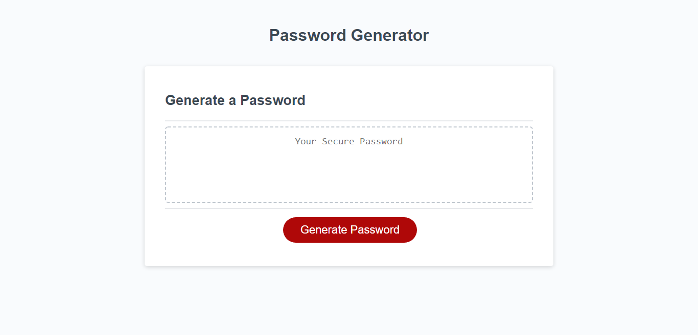

# password-generator

## Description

The task was to create a password generator using JavaScript that would produce a randomised password based on the user's criteria input. The user input needed to follow certain criteria, including:
* Between 8 and 128 characters
* Must include at least one of the following character groups:
  * upper case 
  * lower case
  * numbers
  * special characters

## Screenshots

The page starts like this:

After hitting the 'generate' button, the user will be given a series of prompts, then a password will be generated based on the user input:

## URL

[Deployed URL](https://alishasaleh.github.io/password-generator/)